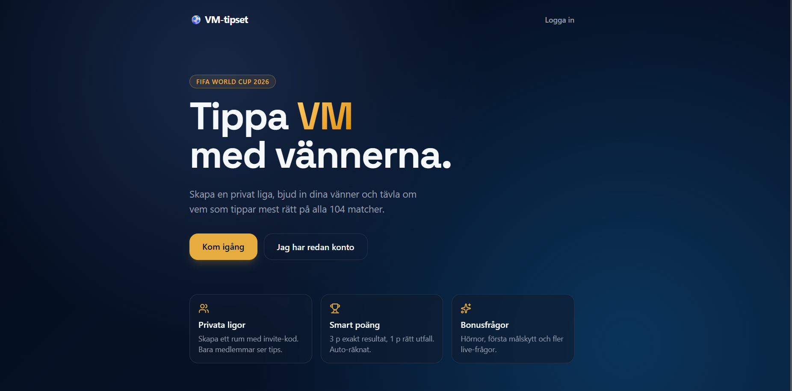
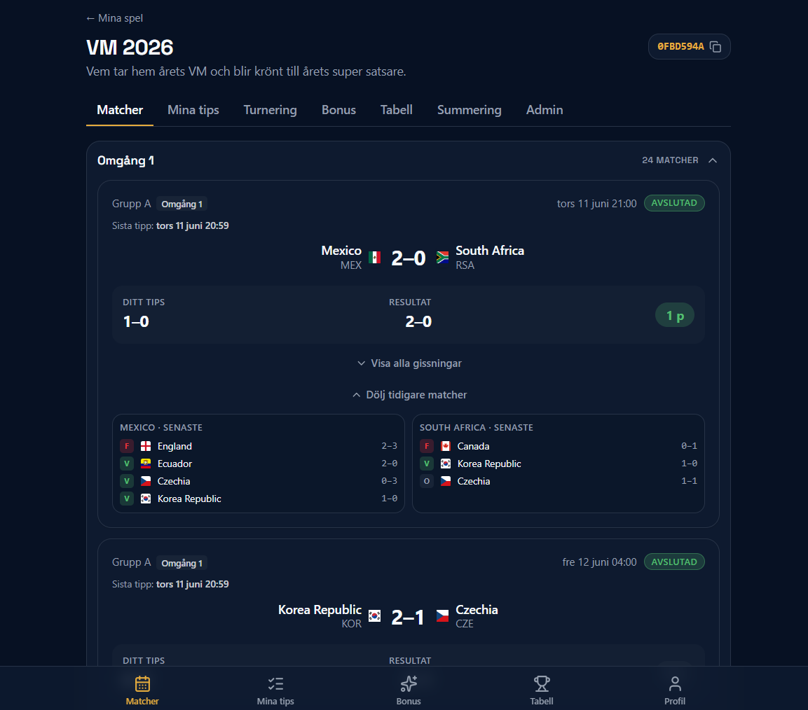
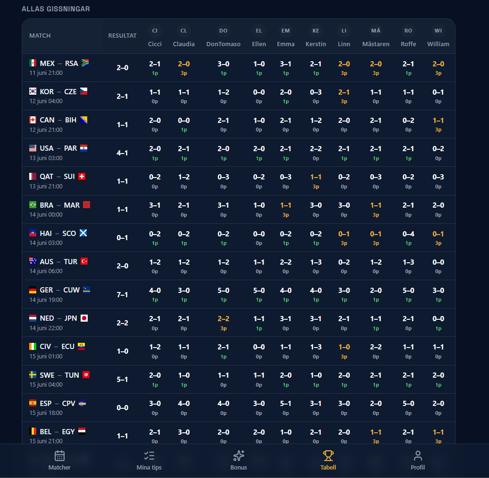
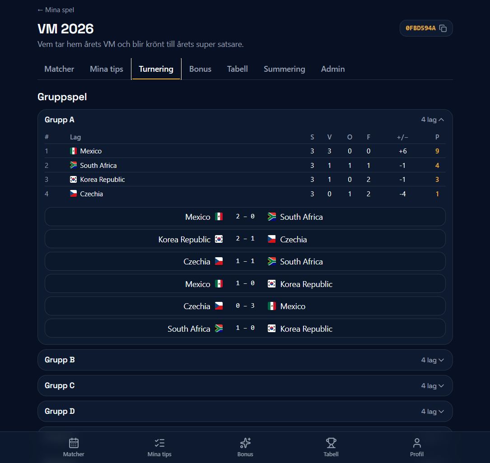
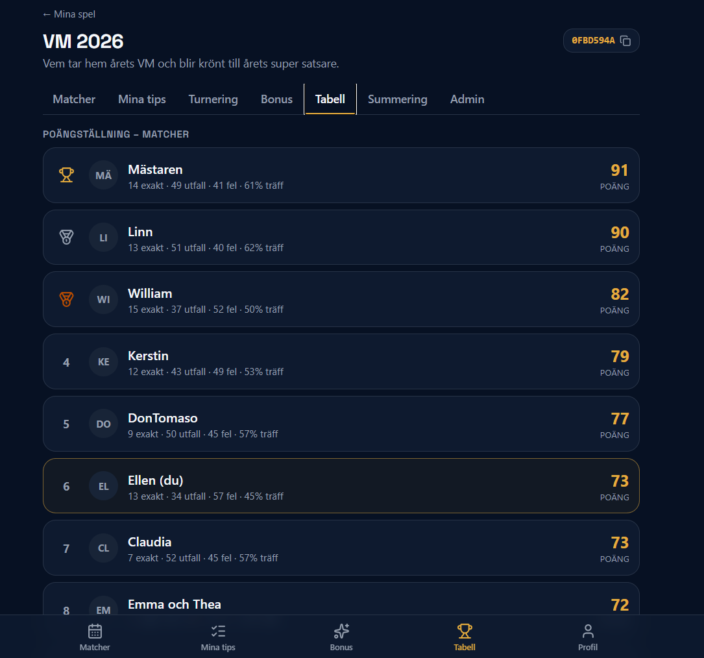
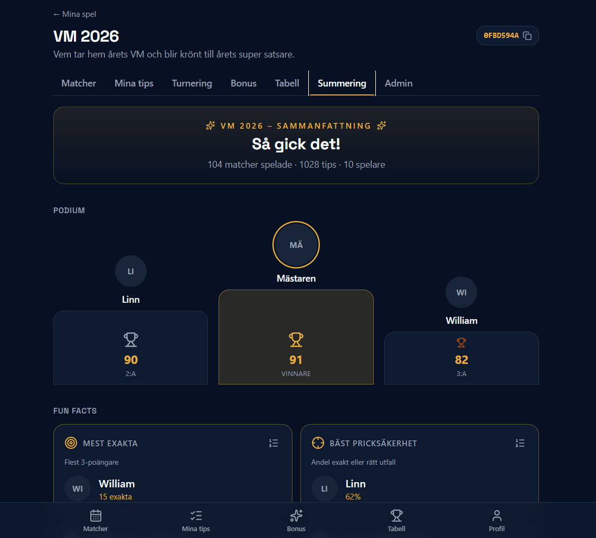
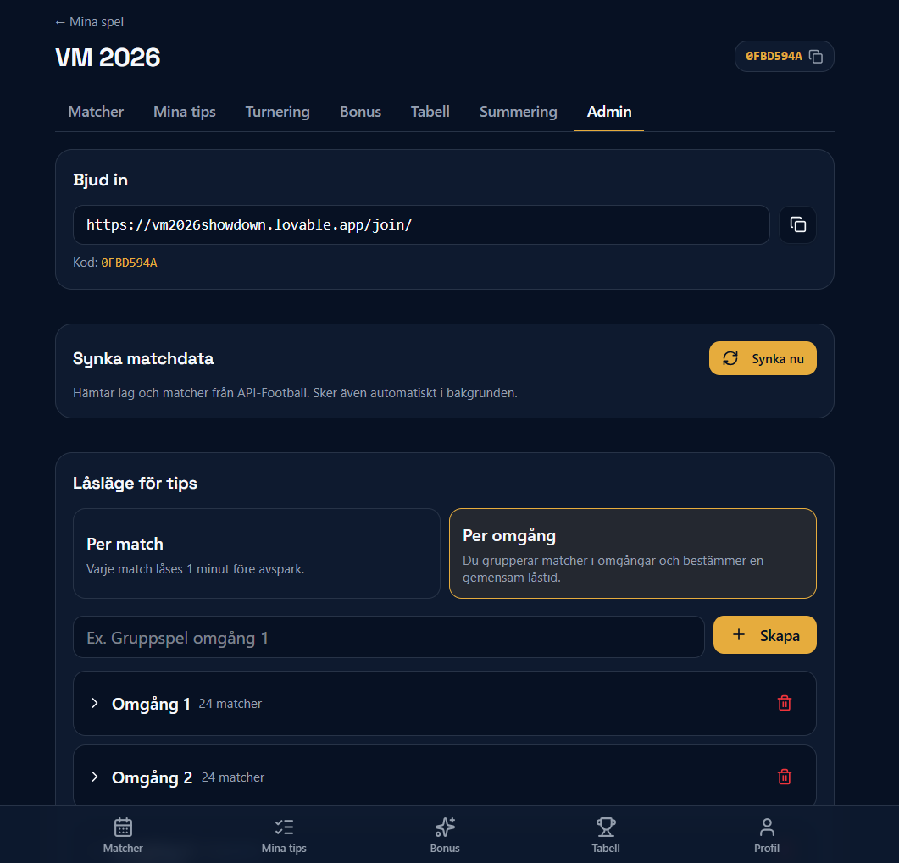
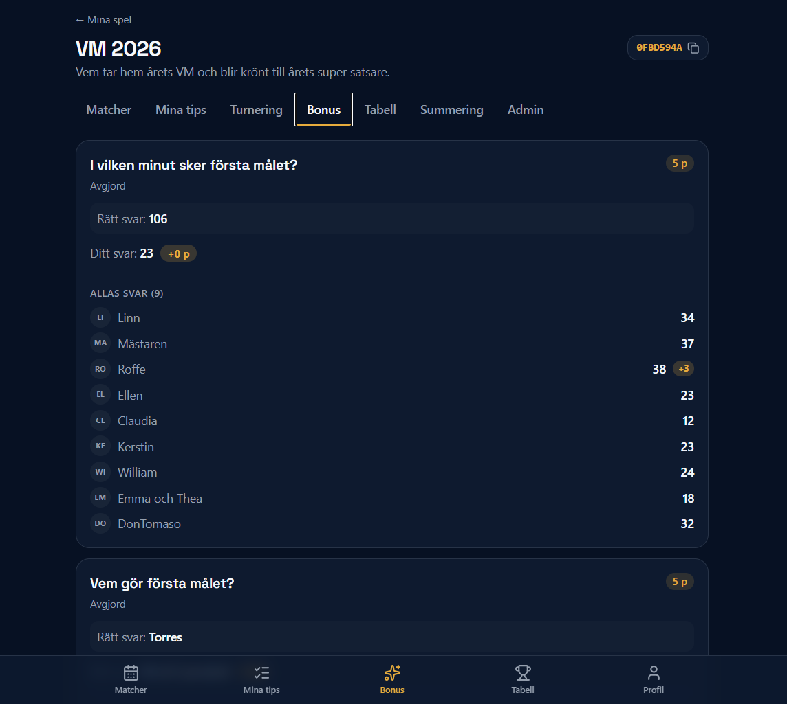

# VM 2026 Showdown

> En privat tippnings-liga för FIFA World Cup 2026 — en fullständig produkt, från onboarding till slutsummering.
> **Live:** [vm2026showdown.lovable.app](https://vm2026showdown.lovable.app) · **English README:** [README.md](./README.md)

En fleranvändar-webbapp där vänner skapar privata ligor, tippar alla VM-matcher, svarar på bonusfrågor och följer en live leaderboard. Byggd som ett portföljprojekt för att visa end-to-end produkttänk — autentisering, behörigheter, tidskritiska affärsregler, automatisk poängberäkning, extern API-integration, realtime och adminverktyg — i en riktig, produktionssatt app som använts av 10 riktiga spelare över 104 matcher och 1 028 tips.

---

## Varför projektet är intressant

De flesta portföljappar stannar vid CRUD. Det här projektet modellerar en verklig domän med verkliga specialfall:

- **Fleranvändarapp med privat data** — varje användare ser bara sina egna ligor, tips och bonussvar tills deadlines passerar.
- **Tidskritiska regler** — tips måste låsas vid exakt rätt tidpunkt, i rätt tidszon, oavsett om admin valt `per_match` eller `per_round`.
- **Server-auktoritativ poängberäkning** — poäng räknas av Postgres-triggers och RPC:er, inte av klienten, så resultatet är konsistent, granskbart och kan räknas om.
- **Ett helt livscykelflöde** — från Google-inloggning och invite-koder till en slutsummering med podium och 20+ fun-fact-rankingar.

Demodata från det avslutade mästerskapet: **104 matcher · 1 028 tips · 10 spelare**, med automatisk leaderboard, separat bonuspoäng, podium och sammanställd statistik.

---

## Skärmbilder

> Lägg PNG-filer i `docs/screenshots/` med filnamnen nedan.

| | |
|---|---|
|  |  |
|  |  |
|  |  |
|  |  |

---

## Funktioner

- 🔐 Google-inloggning via Supabase Auth, med hantering av väntande invites efter login.
- 🏆 Privata ligor med invite-koder och adminstyrda ansökningar.
- ⚽ Tippning per match, lås per match (1 min före avspark) eller per omgång (gemensam deadline).
- 📊 Automatisk poäng: 3 p exakt, 1 p rätt utfall — beräknat direkt i Postgres när resultat sätts.
- ❓ Bonusfrågor: flerval, fritext, numerisk med närmast-rätt, sammansatta frågor. Separat bonus-leaderboard.
- 🏟️ Turneringsvy med gruppspel och slutspelsträd, allt expanderbart.
- 🥇 Slutsummering: podium + 20+ fun-fact-kategorier, varje med en rankinglista.
- 🔔 Realtime-uppdateringar via Supabase Realtime — DB-raden är fortfarande sanningen.
- 📱 Mobile-first med bottom nav och PWA-manifest.

---

## Tekniska val värda att lyfta

1. **Databascentrerad poängberäkning.** Postgres-triggers och RPC:er räknar poängen, inte klienten. En källa till sanning, automatisk omräkning vid rättningar, regler som kan granskas i SQL.
2. **Två låslägen.** `per_match` och `per_round` kodar två olika verkliga användningsfall och tvingade explicita beslut om vilken klocka som gäller (server), vad som händer exakt vid deadline, och hur admin-ändringar av deadline propageras.
3. **Realtime som UX, inte som sanning.** Realtime-eventen pushar UI-uppdateringar; den persisterade raden är auktoritativ. Klienter revaliderar mot DB vid återanslutning så en tappad socket aldrig desynkar poängen.

Fördjupning i [`docs/case-study.md`](./docs/case-study.md).

---

## Min insats vs. verktygets

Projektet är byggt i [Lovable](https://lovable.dev) som AI-assisterad utvecklingsmiljö. Att vara transparent om det är viktigt — men också att inte undersälja det jag faktiskt gjort.

Jag ansvarade för:

- Produktkrav, användarresor och acceptanskriterier för både spelare och admin.
- Poängreglerna (3/1/0, bonuspoäng separat, närmast-rätt för numeriska, sammansatta frågor).
- Datamodellen — tabeller, relationer och RLS-policyer som håller tips privata tills lås.
- De två låslägena och deras specialfall (tidszoner, ändrade deadlines, sena resultat).
- Val och integration av football-data.org efter att API-Football saknade VM 2026 på gratisplan.
- Felsökning i produktion: PostgREST-joins, Supabase 1 000-radgräns som klippte tips, dubbletter efter API-synk, extra-time-resultat som läckte in, tvetydig SQL-kolumn i en RPC.
- Tester av behörighet, låstider och omräkning.
- Iteration av mobil- och desktopupplevelsen under mästerskapet med riktiga användare.

Lovable snabbade upp boilerplate, route-scaffolding och migrationsutkast. Varje beslut ovan, och varje fix på en bugg som bara dyker upp med riktiga användare och riktig data, är mitt.

---

## Kör lokalt

```bash
bun install
bun dev
bun run build
```

`.env`:

```bash
VITE_SUPABASE_URL=...
VITE_SUPABASE_PUBLISHABLE_KEY=...
FOOTBALL_DATA_API_KEY=...
```

---

## Vidare läsning

- [`docs/case-study.md`](./docs/case-study.md)
- [`docs/architecture.md`](./docs/architecture.md)
- [`docs/demo-script.md`](./docs/demo-script.md)
- [`docs/portfolio-checklist.md`](./docs/portfolio-checklist.md)
